# Codex Memory

> 来源：`/Users/yangyilong.elon/.claude/projects/-Users-yangyilong-elon/memory/`
> 用途：每次新 Codex 会话可先读取本文件，恢复用户偏好、项目背景和工作规则。

## 使用方式

新会话中对 Codex 说：

```text
请读取 /Users/yangyilong.elon/Documents/Codex/2026-06-15/new-chat/MEMORY.md 作为当前会话记忆。
```

如果涉及超级月卡/品牌饭卡细节，再读取原始完整知识库：

```text
请读取 /Users/yangyilong.elon/.claude/projects/-Users-yangyilong-elon/memory/project_super_monthly_card.md
```

## 长期偏好与规则

### PRD 模板

- 写 PRD 必须严格按 JoySpace 上「yyl的PRD模板」结构输出。
- 模板 pageId：`2R2xg2rwlhD0PgQFIMY1`。
- 不改变章节顺序，不自创结构，不省略表格列。
- 信息不足处使用 `[待补充]`，但保留完整结构。

### JoySpace PlantUML

- JoySpace 文档中的 PlantUML 必须使用 Markdown 代码块：

````markdown

```plantuml
@startuml
...
@enduml
```

````

- 不要把 PlantUML 转成 PNG 图片嵌入。
- 原因：JoySpace 内置 PlantUML 渲染组件，可直接渲染代码块。

### JoySpace 发布节奏

- 梳理文档时不要每次修改都发布 JoySpace。
- 先在本地把内容全部梳理完。
- 等用户确认内容完毕，或明确要求发布时，再统一上传/发布一次。

## 项目知识：京东外卖超级月卡 & 品牌饭卡

完整知识库原文：

`/Users/yangyilong.elon/.claude/projects/-Users-yangyilong-elon/memory/project_super_monthly_card.md`

后续涉及以下主题时，应优先读取并参考该文件：

- 京东外卖超级月卡
- 品牌饭卡
- 品牌饭卡代我充
- 月卡购卡、用卡、退卡、即买即用
- PLUS 开卡赠月卡
- 月卡效期模型、券包排队、自动续费
- 卡中台、礼品卡、资产账务、红包、激励、OCS/OFC、结算中台
- sendpay、paytype、ocstype、jmjysp、memberSubType、rechargeType 等标识口径
- 品牌饭卡/超级月卡离线表、数据口径、SQL 模板、看板指标
- XML 方案二、CartXML、OrderXML、AssetPaymentInfo、ServiceInfo、monthlyCardInfo

### 核心业务摘要

- 超级月卡是京东外卖本地生活权益卡，本质是品牌饭卡代我充的上层产品包装。
- 月卡有效期 30 天，发放当天为第 0 天，第 30 天 23:59:59 过期。
- 月卡不是卡，更像“门票”：消耗 1 张月卡 = 对 1 个商家执行 1 次代我充即买即用。
- 多商家下单会消耗多张月卡。
- C 端用户不感知代我充订单和余额；B 端商家感知为品牌饭卡，不感知超级月卡。
- 同一商家下品牌饭卡和月卡互斥，不能同时使用。
- 月卡不支持送礼，不限购，权益次数可累加。
- 全部未使用过期后自动退款，退款在过期第二天 9:00 后开始执行。

### 关键标识摘要

| 标识 | 说明 |
|------|------|
| `ordertype=229 && sendpay 1413=1` | 月卡购卡订单 |
| `ordertype=229 && sendpay 1413=1 && 518=1` | 月卡即买即用购卡订单 |
| `sendpay 1414=1 && 518=1` | 月卡即买即用用卡订单 |
| `sendpay 1264=2 && 1360=1 && 1418=1` | 月卡核销充值代我充订单 |
| `ordertype=22 && sendpay 1414=1 && membersubtype=2` | 月卡核销外卖订单子单 |
| `jmjysp=9` | 超级月卡 SKU 商品标 |
| `jmjysp=2` | 品牌饭卡商品标 |
| `memberSubType=2` | 超级月卡代我充 |
| `paytype 507` | 品牌饭卡代我充支付 |
| `paytype 508` | 品牌饭卡代我充本金 |
| `paytype 509` | 品牌饭卡代我充赠金 |
| `ocstype 1146` | 品牌饭卡代我充支付 |
| `ocstype 1147` | 品牌饭卡代我充本金 |
| `ocstype 1148` | 品牌饭卡代我充赠金，商家 100% 承担 |
| `4011` | 品牌饭卡代我充服务费 |
| `4012` | 品牌饭卡代我充还款费 |
| `50366` | 用户实付品牌饭卡代我充还款费，新团购扩展 |

### 数据口径摘要

- 品牌饭卡视图过滤：`gift_card_brand_type = '4' AND gift_card_brand_subtype = '8'`。
- 京东饭卡视图过滤：`gift_card_brand_type = '4' AND gift_card_brand_subtype = '3'`。
- 直接充 memberid：`15-20096293`。
- 代我充 memberid：`15-20096293-1`，尾部带 `-1`。
- `businesssource='111'` 为代我充。
- 品牌饭卡代我充订单口径需剔除月卡代我充：`sendpay 1264=2 且 1360=1 且 1418!=1`。
- 月卡核销充值代我充订单使用 `1418=1`，不是 `1414=1`。

### OCS / 结算摘要

- 超级月卡用卡订单复用品牌饭卡代我充即买即用的 ocstype，不新增费项。
- 4011 开卡服务费和 4012 还款费仅支持在线支付 `paytype=6/ocstype=112` 抵扣。
- 需屏蔽支付营销、白条免息拆单和本金营销。
- 代我充赠金 `1148` 作为抵扣项，抵扣范围包括货款、运费、4009、495、4008、483、4014、4010。
- 到手价口径：货款到手价 = 货款原价 - 促销 - 优惠券 - 赠金。

### 逆向规则摘要

- 月卡购卡快退：未使用 → 全额退款；已使用 → 不支持退款。
- 即买即用取消：外卖订单取消 → 权益次数恢复；购卡子单不联动取消，需单独操作。
- 充值中取消：不支持，返回“品牌饭卡充值中”。
- 充值成功后取消：走消费退款，各品牌饭卡本赠金退回各自账户。
- 退款明细不展示品牌饭卡相关费项（代我充支付/本金/赠金）。

## 原始文件索引

| 文件 | 用途 |
|------|------|
| `/Users/yangyilong.elon/.claude/projects/-Users-yangyilong-elon/memory/MEMORY.md` | Claude memory 索引 |
| `/Users/yangyilong.elon/.claude/projects/-Users-yangyilong-elon/memory/feedback_prd_template.md` | PRD 模板规则 |
| `/Users/yangyilong.elon/.claude/projects/-Users-yangyilong-elon/memory/feedback_joyspace_plantuml.md` | JoySpace PlantUML 规则 |
| `/Users/yangyilong.elon/.claude/projects/-Users-yangyilong-elon/memory/feedback_joyspace_publish_last.md` | JoySpace 发布节奏规则 |
| `/Users/yangyilong.elon/.claude/projects/-Users-yangyilong-elon/memory/project_super_monthly_card.md` | 超级月卡 & 品牌饭卡完整知识库 |
